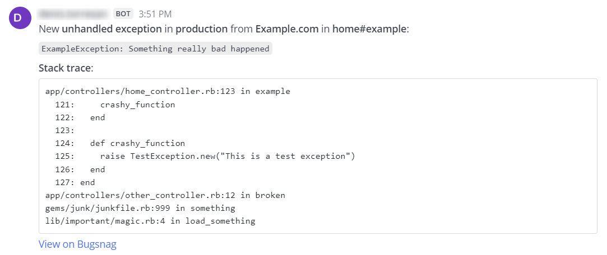

# Bugsnag / Insight Hub Mattermost Hooks proxy

Bugsnag / Insight Hub does not provide any integration for Mattermost, only Slack is supported. 

This small service allow to proxy the Bugsnag Webhook integration for posting events on a Mattermost channel.



## Setup

1. Edit docker-compose.yml and modify the environment variable accordingly to your Mattermost server:
    
    `MATTERMOST_URL: https://mattermost.example.com`

2. Start your self-hosted service using:

   ```
   docker build --pull --no-cache -t goodmagma/bugsnag-mattermost-hooks:latest .
   docker-compose up
   ```

3. Publish the service on a public domain like `https://mattermost-hooks.example.com`

## Configure Webhook

1. Go to Mattermost > Integration > Incoming Webhooks and configure a webhook that post on a specific channel.
2. Copy Webhook URL, like https://mattermost.example.com/hooks/q79r5di8UjyfjpDbw3e9U4em3s
3. Take only the hook id (eg: q79r5di8UjyfjpDbw3e9U4em3s)
4. Go to Bugsnag > Settings Integrations > Data Forwarding > Webhook
5. Fill the Webhook URL with https://service-url/hooks/hook-id (eg: https://mattermost-hooks.example.com/hooks/q79r5di8UjyfjpDbw3e9U4em3s)
6. Hit TEST button in order to test it


